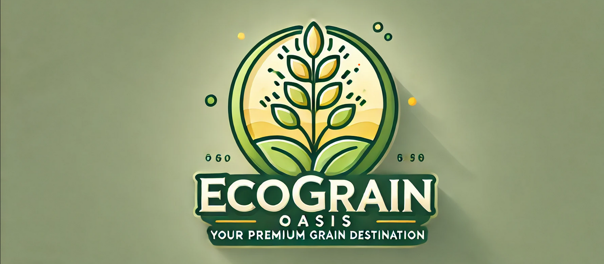

### About

EcoGrain Oasis project helps new small enterprises' owners to develop simple programs to operate their store inventory, especially for grain or food products. This program is best for new owners since it has the automation system to input the code or product id, making it stored in numerical order. 
It also offers you necessary features including:

1. **Show menu**, displays the entire stock inside the database. The stock will always be updated.
2. **Add**, used to input new items in the database. The code as the key value will be automatically updated by the system. Then it will allow the user to input the other details; product name, quantity/ stock, price.
3. **Update Database**,it allows users to make updates to the items inside the database by input the code as the key value.
4. **Delete**, allows the user to remove any item that is no longer available in the database for some reasons whether it is no longer being sold or expired. 
5. **View Statisticse**, allow users to check the total stock and total values. 
6. **Filter by type**, displays the products by the type; organic and non organic. 

## Installation

To get this project, you can clone it by running the following code:

   https://github.com/Anjarwenig/EcoGrain-Oasis-Project.git

    
## Project Organization

The directory structure of FruitMarket project looks like this:

    ├── README.md          <- The top-level README for developers using this project.
    │
    ├── data               <- EcoGrain
    │
    ├── docs               <- The document will consist of a detailed presentation or images.
    │
    ├── src                <- Source code for use in this project.
    │
    └── requirements.txt   <- The requirements file for reproducing the analysis environment, e.g.
                             generated with `pip freeze > requirements.txt`

## Contribute

If you'd like to contribute, feel free to contact me here:

  
